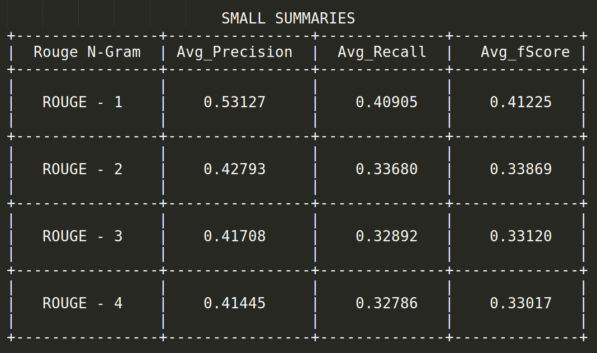

# JusticeLeague
Welcome to the repository of Team - **JusticeLeague**.

This is the repository for our term project - **Automatic Document Summarization using a Machine Learning approach**.

##Team:
    Sai Sriharsha Annepu  -  13CS10012
    Ananth Pranihith. P   -  13CS10011
    Thejesh Venkata       -  13CS10013
    Pavan Reddy. B        -  13CS10015
    Jyothi Swaroop. B     -  13CS10016
    Prithvi Raj Reddy     -  13CS10029
    Konda Akhil           -  13CS10030
    Sai Sambasiva. P      -  13CS10034
    Supradeep Allu        -  13CS10050
    Aswanth Kumar         -  13CS30019
    Suryateja Chunduru    -  13EE10017
    Prasanth Balaga       -  09CS3031    
---------------------------------------------------------------------------------------------

##Introductory Presentation:
 Please follow this link to the RoadMap Presentation - [DocSummarization-ML](https://github.com/cs60050/ML-JusticeLeague/blob/master/DocSummarization-ML.pdf)
 
---------------------------------------------------------------------------------------------

##Pre-Processing:
 The pre-processing is being done using the following steps -
 

---------------------------------------------------------------------------------------------

##Features Identified:
 Our summarizer produces summaries using a feature profile oriented sentence extraction stategy. The following features have been identified as important:
 
    1)  CUE PHRASES
    2)  SIMILARITY TO THE TITLE
    3)  TF-ISF
    4)  DEGREE CENTRALITY
    5)  C-LEX RANK
    6)  TEXT RANK
    7)  NON-ESSENTIAL WORDS (Like "Additionally")
    8)  NUMERICAl DATA
    9)  SENTENCE LENGTH
    10) WORDNET BASED RANKING

----------------------------------------------------------------------------------------------

## Feature Extraction
  **Mean TF-ISF** 
  
  This feature is analogous to TF-IDF in the context of Information Retrieval. In IR, we have to select few documents which are most relevant from a given set of documents. Here, we have to select few sentences from the given document.The used feature is calculated as the mean value of the TF-ISF measure for all the words of each sentence. The feature is calculated in the following way-
  
    
  
  **Sentence Length** 
  
  Sentences of too short length add little value when included in the summary. This feature is used to penalize such sentences so that they will not be included in final summary.

  **Sentence Position** 
  
  Sentences at the start of the document and also at the end of the document generally have more importance and are candidates to be included in the summary. Even, sentence position in each paragraph is useful, but here the summarizer checks for the overall position and weights accordingly (as it summarizes news articles which generally tend to have information about a single aspect and not divided into paragraphs - Identified from the corpus present with us). This is the graph which shows the normalized weights assigned to sentences-
  
  

 **Wordnet Ranking**

   We created list of Keywords by taking Adjectives,nouns and Propernouns.We have calculated number of times a particular word or its synonyms occured in document by using synset.Now if Keyword is a properNoun a score of 1 is assigned or else a highest similarity score is assigned which is calculated with respect to synonyms of other words present in document.Now for each sentence a score is assigned which is (sum of scores of all keywords present in the sentence)/(Number of keywords present in sentence).

 **Numerical Data**
  
   Sentences containing numerical data have higher chance of getting included in the extractive summary of the document. This feature emphasis on the numerical data present in the sentences. The numerical data generally correspond to some computed values or results which are important to be included in the summary. So, the sentences having numerical data, we add extra score to them.

 **Proper Nouns**
  
   Sentences containing proper nouns are having greater chance of getting included in summary. The motivation for this feature is that the occurrence of proper names, referring to people and places, are clues that a sentence is relevant for the summary. This is considered here as a binary feature, indicating whether a sentence  contains (value "true") at least one proper name or not (value "false"). Proper names were detected by a part of speech tagger.
   
  **Text Rank**
  
   The TextRank algorithm exploits the structure of the text itself to determine keyphrases that appear "central" to the text in the same way that PageRank selects important Web pages. TextRank is a general purpose graph-based ranking algorithm for NLP. For keyphrase extraction, we built a graph using some set of text units as vertices. Edges are based
on some measure of semantic or lexical similarity between the text unit vertices. Unlike PageRank, the edges are typically undirected and can be weighted to reflect a degree of similarity. The proposed graph based text ranking algorithm consists of three steps - word frequency analysis; word positional and string pattern based weight calculation algorithm; ranking the sentences by normalizing the results above

----------------------------------------------------------------------------------------------

## Training the summarizer

   The summarizer was trained with a set of documents and their respective gold standard summaries using supervised learning algorithms. To accomplish this, a classification function that estimates the probability of a sentence being selected in the summary was developed. We were given with a set of training documents, their respective summaries and a feature vector file for each of those training documents. A feature vector file was containing feature vectors of all the sentences of the respective training document. A feature vector is a tuple of feature values of a sentence. We combined the feature vectors from all those files and divided them into two classes. First one, containing the feature vectors of the sentences
that are selected into the summary and the other containing the feature vectors of the sentences which are not selected into the summary. Using the feature vectors in a class, the variance and standard deviation of the values for each feature have been computed for that class.

----------------------------------------------------------------------------------------------

## Summary generation

   A feature vector file is prepared for the given input document with a feature vector for each of its sentence. Now the feature vectors of these are classified into one of the two classes mentioned above, using naive bayes classifier. The variance and standard deviation values that were learned in the training phase are used for calculating the probabilities that involved in the naive bayes formula (probability formula of normal distribution involving variance and standard distribution is used). The sentences whose feature vectors fall into the first class make up the output summary. 

----------------------------------------------------------------------------------------------

## ROUGE Results

   The ROUGE evaluation toolkit is employed to evaluate the proposed algorithm. ROUGE, an automated summarization evaluation package based on Ngram statistics, is found to be highly correlated with human evaluations. The evaluations are reported in ROUGE-1 metrics, which seeks unigram matches between the generated and the reference summaries. The ROUGE-1 metric is found to have high correlation with human judgments at a 95% confidence level and hence used for evaluation.

The results obtained for the summarizer developed are shown below.

 

 

----------------------------------------------------------------------------------------------

## Final Presentation:
 Please follow this link to the Final Presentation - [DocSummarization-ML-Final-PPT](https://github.com/cs60050/ML-JusticeLeague/blob/master/JusticeLeague_PPT.pdf)
  Please follow this link to the Final Report - [DocSummarization-ML-Final-Report](https://github.com/cs60050/ML-JusticeLeague/blob/master/JusticeLeague_Report.pdf)
 
---------------------------------------------------------------------------------------------

